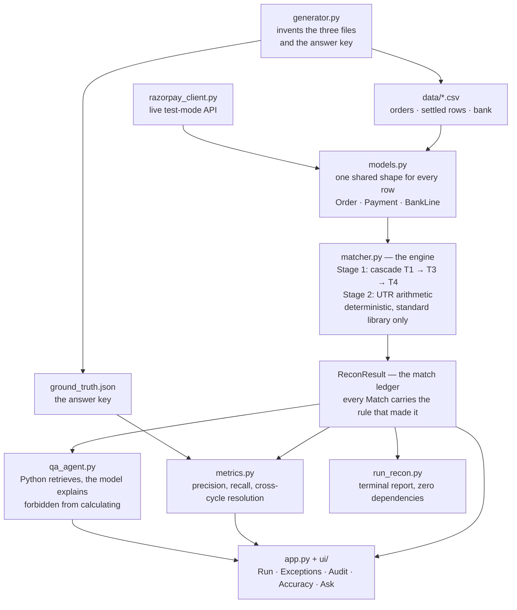
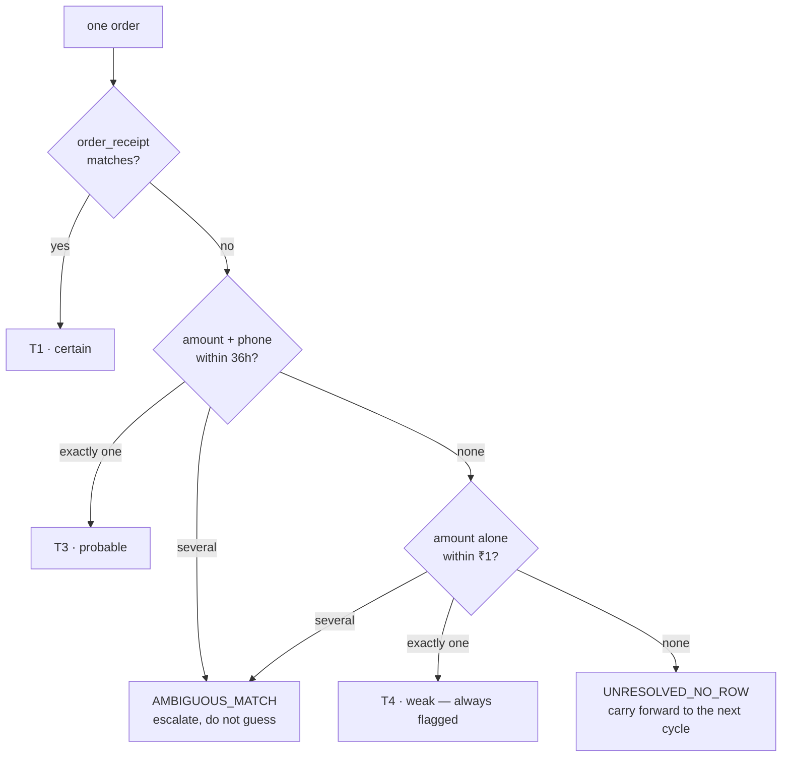

# Settlement Recon

**A reconciliation controller for merchants on Razorpay.** Three sources in — the merchant's order list, Razorpay's settlement recon report, a bank statement — one answer out: what matched, what didn't, and how much money is at stake.

Built for the Razorpay AI Buildathon, **Track 04 — AI Finance Controller**.

```
250 orders · 236 settled rows · 1 bank credit
completed in 2 ms (137,435 orders/sec)

MATCHED   211 / 250  = 84.4%
    T1_RECEIPT        201     ← merchant's own id, echoed by Razorpay
    T3_AMOUNT_PHONE     8     ← no receipt; amount + phone + window
    T4_AMOUNT_ONLY      2     ← weak, always flagged

EXCEPTIONS 92   ₹114,315.00 at risk
    CRITICAL  CHARGEBACK              4
    HIGH      UNRESOLVED_NO_ROW      27
    HIGH      AMBIGUOUS_MATCH        12
    HIGH      FEE_MISMATCH           12
    ...
```

---

## The problem

A shop sells ₹1,00,000 on Monday. On Tuesday the bank shows ₹97,300.

The ₹2,700 gap is legitimate — fees, tax on fees, a refund, two orders that slipped into the next cycle, one chargeback. But nothing tells the merchant that. Three separate records describe the same money in three different vocabularies:

| Source | Says | Join key |
|---|---|---|
| Shop's order system | `ORD-0007`, ₹2,500 | its own ids |
| Razorpay recon report | `pay_g7f2…`, ₹2,500, fee ₹50 | `order_receipt` — **if it was set** |
| Bank statement | one credit, ₹97,300 | a UTR, nothing else |

The bank sees a lump. Razorpay never saw the shop's order system. So someone opens three exports and matches rows by hand, every settlement cycle, forever — and quietly misses the orders that were never actually paid for.

## What this does

**Two different matching problems, kept apart because they are different shapes.**

```
ORDERS  ←──────→  RAZORPAY           row to row, via a cascade of join keys
RAZORPAY  ←────→  BANK               bundle to one line, via UTR + arithmetic
```

**Stage 1 — the cascade.** `order_receipt` is the primary key, but it is missing or wrong constantly in real data, so the engine falls back and records which rule fired:

```
T1  order_receipt matches exactly              certain
T2  Razorpay payment_id stored by the shop     certain
T3  amount + date window + customer phone      probable
T4  amount alone, within tolerance             weak — always flagged
—   several candidates, nothing separates them → escalate, do not guess
—   nothing at all                             → carry forward to next cycle
```

**Stage 2 — the bank.** The bank has no order ids. Each credit is proved by arithmetic: the net of every row carrying that UTR must equal the amount credited, or the difference becomes an exception on the settlement itself.

## The rule that makes the numbers mean anything

**Python matches. The model only explains.**

An LLM anywhere in the matching path makes the match rate unreproducible, and an unreproducible match rate is not a metric. So `recon/` is pure standard library — no model, no dependencies — and the model layer sits above it, reading a ledger it cannot modify.

The same discipline runs through the exception taxonomy: when the engine knows *that* something is wrong but cannot prove *why*, it lists the possibilities instead of picking one.

```
UNRESOLVED_NO_ROW  ORD-0009  ₹5,040.00 at risk
  Order ORD-0009 is marked PAID but no settled row matches it in this cycle.
  Carried forward — the next cycle will resolve or confirm it.
    · Settles in a later cycle and is simply not in today's report
    · Razorpay is holding the payment for risk review
    · Refunded without the shop's system being updated
    · Payment failed and was wrongly marked paid — goods may have shipped
      without payment
```

Only the fourth is expensive. The engine cannot tell which applies today, so it says so.

## Closing the loop

A late payment is **absent** from today's report — tomorrow's report does not exist yet. So on cycle one, a phantom order and a late settlement are genuinely indistinguishable. The engine declines to guess and carries both forward.

Run the next cycle and the question answers itself:

| | Cycle 1 | Cycle 2 |
|---|---|---|
| Carried forward | 27 | — |
| Closed once the rows arrived | — | 22 *(21 correctly, 0 wrongly)* |
| Still open | 27 | **5** — the real phantoms |
| Match rate | 84.4% | **93.2%** |

Not one rule changed between those runs. The engine did not get smarter; it stopped being asked a question the data could not yet support.

## Measured, and honestly

`generator.py` plants every defect at a known id and writes `ground_truth.json`. That answer key is why this reports accuracy rather than asserting it.

Results are split three ways, because blending them would overstate what has been demonstrated:

**Matching — the hard part.** 84.4% on cycle one, 93.2% after the next. The rest are ambiguous or missing.

**Inferred — scored.** Conclusions the engine works out.

| Check | Planted | Found | Precision | Recall |
|---|---|---|---|---|
| `AMBIGUOUS_MATCH` | 12 | 12 | 1.00 | 1.00 |
| `FEE_MISMATCH` | 12 | 12 | 1.00 | 1.00 |
| `SPLIT_CAPTURE` | 6 | 6 | 1.00 | 1.00 |
| `MISSING_RECEIPT` | 10 | 10 | 0.90 | 0.90 |
| `UNRESOLVED_NO_ROW` | 27 | 27 | 0.96 | 0.96 |
| **Overall** | | | **0.973** | **0.973** |

**Read from Razorpay's `type` column — counted, never scored.** Chargebacks and refunds are reported 4/4, 6/6, 8/8 — but detecting them means reading a labelled field. Such a check cannot be wrong, and scoring it would inflate the headline with something that was never in doubt.

Two checks earn their score. `FEE_MISMATCH` runs against sub-rupee rounding drift planted specifically to trip a careless threshold. `SPLIT_CAPTURE` versus `DUPLICATE_SETTLEMENT` is pure inference: two rows on one order are identical until the arithmetic is done — parts that *sum* to the order value are a part capture, parts that each *equal* it are a double charge.

## Razorpay integration

`recon/razorpay_client.py` reads test-mode settlement data:

- `GET /v1/settlements/recon/combined?year&month` — the settled rows, mapped onto the same shape the generator produces, so the engine cannot tell them apart
- `GET /v1/settlements` — settlement headers carrying the UTR the bank will show
- `POST /v1/orders` — seeds test data, and refuses to run against a live key

`order_receipt` is the whole reason clean reconciliation is possible: set it when creating the order and Razorpay echoes it back on every settled row. Its absence in real merchant data is the single largest source of unmatched rows, which is why the cascade exists.

Without credentials the app runs on synthetic data. **The demo never depends on a network.**

## Running it

```bash
git clone <repo> && cd settlement-recon
pip install -r requirements.txt      # optional — see below

python run_recon.py --generate       # engine only: no dependencies at all
streamlit run app.py                 # dashboard
pytest -q                            # 20 tests
```

`recon/` is standard library only. `python run_recon.py --generate` works on a bare interpreter — the requirements are for the dashboard and the two optional integrations.

```bash
python run_recon.py --orders 5000    # scales: 5,000 orders in ~18 ms
```

### Optional credentials

```bash
cp .env.example .env      # then paste your keys into it
```

```
RAZORPAY_KEY_ID=rzp_test_xxx       # Dashboard -> Test Mode -> Account & Settings -> API Keys
RAZORPAY_KEY_SECRET=xxx
ANTHROPIC_API_KEY=sk-ant-xxx       # console.anthropic.com -> API Keys
# ...or instead:
GEMINI_API_KEY=AIzaxxx             # aistudio.google.com/apikey (free tier)
```

Exported shell variables take precedence over the file. Both are optional and the sidebar shows which are active — absent either, the app falls back and says so on screen rather than failing.

With Razorpay keys the sidebar offers a **Live Razorpay** source. Because a new test account has no payout history, the client reads the best source it can and names which one it used:

| Tried | Present on a new test account |
|---|---|
| `/v1/settlements/recon/combined` | No — nothing has been paid out |
| `/v1/payments` | Only once someone has been through checkout |
| `/v1/orders` | Yes — these are the ones you created |

Falling back to payments means no UTR and no fee breakdown exist yet, so the bank stage is skipped and only order-to-payment matching runs. Falling back to orders alone still says something true: these exist and nothing has settled against them. **Seed 12 test orders** in the sidebar creates real orders carrying `receipt: ORD-90xx`.

## Asking the ledger

The controller's real question is never *"what is a chargeback"*. It is *"why is Thursday's payout ₹4,312 short"*.

`recon/qa_agent.py` answers from the match ledger and nothing else. Retrieval is deterministic — Python selects the relevant rows before the model is called, so the model never searches and never has to be trusted to find the right record. It is then forbidden from calculating: every figure it can quote is pre-computed and handed to it. The dashboard shows exactly what it was allowed to see.

Either Anthropic (`claude-opus-5`) or Gemini works — the grounding lives in the retrieval layer, not in which model answers, so the provider is interchangeable. With no key configured, the same question is answered directly from the ledger.

## The screens

| | |
|---|---|
| **Run** | Match rate, money at risk, and which rule tier each match rests on |
| **Exceptions** | The work queue — highest severity first, then largest amount |
| **Audit Trail** | Every pairing with the rule that produced it, searchable |
| **Accuracy** | Scored against the answer key, misses included |
| **Ask** | Grounded Q&A over the ledger |

## Architecture



Every arrow points upward out of the engine. `recon/` imports nothing from `ui/`
or `app.py`, which is why `python run_recon.py` works on a bare interpreter —
and why the engine cannot tell a live Razorpay row from a generated one.

### The cascade



## Layout

```
recon/
  models.py           data shapes, exception taxonomy, inferred-vs-labelled split
  generator.py        synthetic three-file generator + ground-truth answer key
  matcher.py          the cascade, the bank check — deterministic, no dependencies
  metrics.py          three-way scoring and the cross-cycle resolution loop
  razorpay_client.py  test-mode settlement ingestion
  qa_agent.py         grounded Q&A over the match ledger
ui/                   dashboard components and stylesheet
tests/                20 tests — one per tier and exception, plus regressions
run_recon.py          CLI
DECISIONS.md          what broke, and why things are the way they are
```

## What broke

Recorded in full in [`DECISIONS.md`](DECISIONS.md), each with a named regression test:

- **Partial refunds read as overcharges.** Razorpay levies its fee on the captured amount, not the refunded portion. Comparing against the wrong base flagged every partial refund. Fee precision 0.60 → 1.00.
- **Weak matching stole payments.** With two orders at the same value, the amount-only tier could claim a payment whose receipt named a *different* real order — and that order was then reported missing. One bad match produced two wrong answers.
- **Contested rows double-counted.** Payments tied up in an ambiguity are already named by that exception; sweeping them into the orphan bucket reported the same rupees twice. Orphan precision 0.25 → 1.00.
- **Accuracy overstated itself.** The first version reported one blended precision of 1.000 across all checks — including ones that only read Razorpay's `type` column. Split into inferred and labelled, and the headline is now 0.973 with the misses named.
- **Cycle two re-flagged everything that had already settled.** Comparing every row to the new payout's UTR turned 236 correctly settled rows into 189 `LATE_SETTLEMENT` findings, burying the 22 that had actually changed. Cycle two: 281 exceptions → 70, ₹419,287 → ₹63,311.
- **Retrieval could not see what a question was about.** *"How much am I being overcharged in fees?"* returned *the facts do not specify* — the grounding working exactly as designed, and the retrieval failing, because fee rows are small and never survived the largest-amounts cut. It now answers ₹143.95 across 12 exceptions, which matches the ledger exactly.

## Limits

- Match rates and accuracy are measured against generated data with a known answer key. Real merchant data is messier, and the honest expectation is that the weak tiers degrade first.
- The bank stage assumes one credit per UTR. Merchants whose bank merges or splits payouts would need that relaxed.
- Ambiguous pairs are escalated, never resolved. Resolving them needs information the settlement report does not carry.
- The Gemini path has been exercised against a real key — the truncation and model-discovery fixes in [`DECISIONS.md`](DECISIONS.md) came out of running it. The Anthropic path is written against the documented SDK but has not been run. The ledger-only fallback is what runs by default and is what the tests cover.
